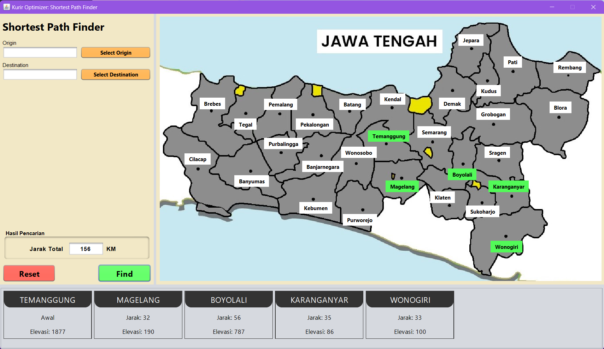

# Kurir Optimizer - Jawa Tengah (Dijkstra's Algorithm)

## What is Kurir Optimizer?

This project is a simple application that implements Dijkstra's Algorithm to find the shortest path between two cities 
in Jawa Tengah, Indonesia. The application is built using Java and Swing. The application will find the shortest path
between two cities and display the path on the map and list. There are 29 cities in total as the vertices.

## Project Structure

```
src
└── main                    
    ├── java
    │   ├── gui                 # Contains GUI files
    │   ├── models              # Contains models/objects used in the app
    │   ├── utils               # Contains utility files
    │   └── KurirOptimizer.java # Main/runner class
    └── resources           
        └── images              # Contains images used in the app
```

## Preview



## Contributors

These are the people who contributed to the project:

| Nr | Name                                    | NIM  |
|----|-----------------------------------------|------|
| 1  | [Nara](https://github.com/vianneynara)  | -091 |
| 2  | [Ditya](https://github.com/BoniRaDityA) | -085 |
| 3  | [Dito](https://github.com/markusdito)   | -087 |
